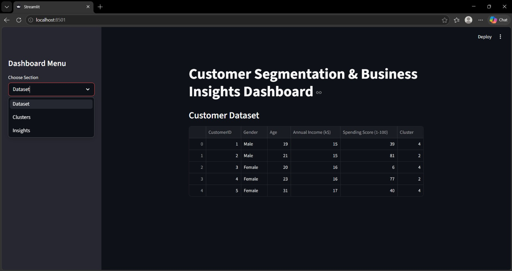

# 🛍️ Customer Segmentation Dashboard

Machine learning dashboard using K-Means clustering and Streamlit.

🚀 **Live App:** [Click here to view](https://customer-segmentation-dashboard-d5lgfb57sg3cwdu9pqx26a.streamlit.app/)

## ✨ Features

- Customer segmentation using K-Means clustering
- KPI metrics for quick insights
- Interactive dashboard with filters
- Prediction system for new customers
- Pie chart analytics for segment distribution

## 🛠️ Technologies

- Python
- Streamlit
- Pandas
- Scikit-learn

## 📁 Files

| File | Description |
|------|-------------|
| `app.py` | Streamlit web app |
| `customer_segmentation.py` | ML pipeline |
| `Mall_Customers.csv` | Dataset |
| `requirements.txt` | Dependencies |

## 👤 Author

**Pranavi Reddy**  
[GitHub](https://github.com/pranavireddyreddy9-ux)
